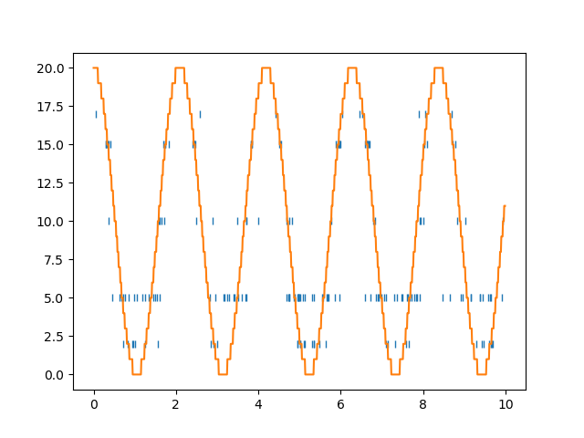
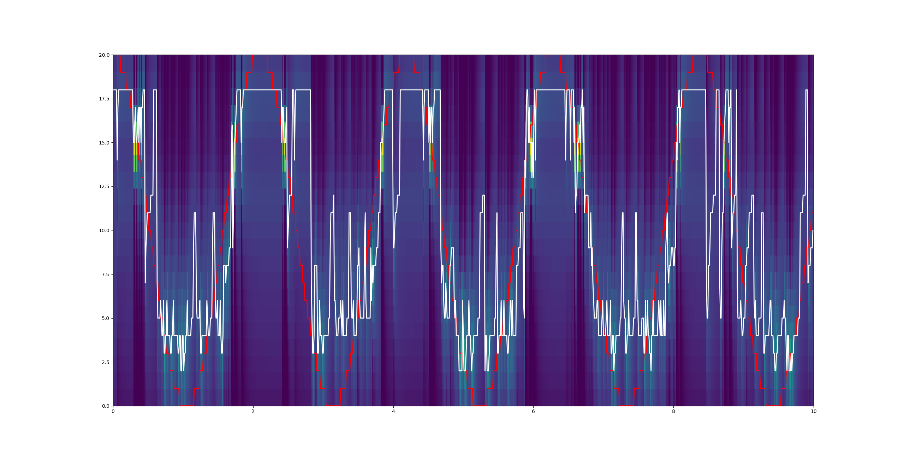

# SpikeDecoding
Project for brain state sensitive spike decoding

# Author
Christoph Kirst, University of California San Francisco

# Example

<<<<<<< HEAD
Decoding test sinosoidal trajectory:

 

to a posterior probability for the position:

 

